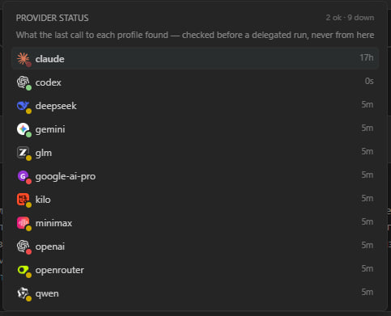
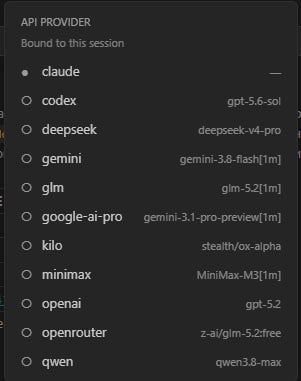

# Vannevar Code

> Switch API providers from inside the Claude Code UI — per tab, without touching global settings.

**Claude Code for VS Code** can switch *models* within one provider, but not the provider itself.
Changing it means editing `~/.claude/settings.json` by hand, and the change is global for every session.

Vannevar Code moves that switch into the UI and makes it **per tab**: one tab can run on Anthropic,
another on DeepSeek, a third on your ChatGPT subscription.

## Screenshots

| | |
|---|---|
|  |  |
| *"Switch provider…" is the first entry in the Model section of the command menu* | *Each profile from `~/.claude/profiles/` is listed with its actual upstream model* |
|  |  |
| *The active profile appears in the badge; the model picker shows the real upstream model* | *Same tab — answer from DeepSeek V4 Pro, 1M context* |


*The session history: every past session carries the icon of the provider it actually ran on.*

## What you get

- **"Switch provider…"** — the first entry in the *Model* section of the command menu, showing the
  active profile. Switching restarts the `claude` process on the same channel with `resume`, so the
  conversation survives and other tabs are untouched.
- **Compact before switching** — a tab with history is asked *Compact & switch* / *Switch as is*. The
  prompt cache never survives a provider change, so the first turn on the new backend pays for the whole
  transcript either way; sending a summary instead is what makes it cheaper.
- **Auto-compact before the cache expires** and **History before compaction** — two switches under
  *Thinking*, both off by default. The first runs `/compact` five minutes before a 1-hour cache tier
  lapses; the second shows everything a `/compact` folded away when a session is reopened (a view only —
  the model's context is still the summary).
- **Switching back to Anthropic keeps working.** An id minted by another provider is rejected by
  Anthropic with a `400`, forever, because it is re-read from the transcript on every relaunch. Spawns
  going to Anthropic have those ids dropped first; ids Anthropic itself issued are left alone.
- **Provider icons** on the tab and on every row of the session history, **pinned sessions**, **real
  model names** in the picker, **message timestamps**, **quote selection**, **local spellcheck**,
  **taking back the last message**, **searching sessions by what was said in them**.
- **"Provider status…"** — one row per profile with the verdict of the last call actually made to it:
  answered, refused (with the provider's own words), never replied, never asked. Nothing is probed to
  draw it.
- **Delegating a task to another provider** through a bundled MCP server, with a live frame under the
  subagent showing what it is doing while it does it.
- **Non-Anthropic providers** through a bundled protocol adapter: OpenAI, OpenRouter, DeepSeek, Groq,
  Together, Ollama — and the ChatGPT Plus/Pro subscription.
- **The patch survives Claude Code updates** — see [below](#after-a-claude-code-update).

## Install

Install **Vannevar Code** from the Marketplace (or Open VSX in Cursor, Windsurf and VSCodium), or take
the `.vsix` from [Releases](https://github.com/beatlejute/vannevar-code/releases) and

```bash
code --install-extension vannevarcode-2.1.276.vsix
```

Nothing else to run: on the first window it copies its runtime into `~/.claude/vannevar`, applies the
patch to the installed Claude Code bundle, drops two template profiles into `~/.claude/profiles/` and
registers the delegated-agent MCP server. Then reload the window when it asks.

Requirements: the `anthropic.claude-code` extension, and VS Code 1.85 or newer. There is no Node
requirement — the extension host's own runtime is used, which matters since Claude Code stopped
shipping one in 2.1.227.

## Profiles

A profile is a JSON file in `~/.claude/profiles/`; its name is what the picker shows.

```json
{
    "env": {
        "ANTHROPIC_BASE_URL": "https://api.deepseek.com/anthropic",
        "ANTHROPIC_AUTH_TOKEN": "sk-...",
        "ANTHROPIC_DEFAULT_OPUS_MODEL": "deepseek-v4-pro",
        "ANTHROPIC_DEFAULT_SONNET_MODEL": "deepseek-reasoner",
        "ANTHROPIC_DEFAULT_HAIKU_MODEL": "deepseek-chat"
    }
}
```

A profile with an empty `env` means the Anthropic subscription. `~/.claude/settings.json` is **never
modified**. **Vannevar: Open profiles folder** opens the directory.

## OpenAI and the ChatGPT subscription

Anything that speaks the Anthropic protocol needs only the profile above. Everything else goes through
the adapter bundled with the extension, which translates both the Chat Completions and the Responses
API — set `"CCX_PROXY": "openai"` in the profile's `env` and point `ANTHROPIC_BASE_URL` at the provider.
`templates/profiles/openai.json` and `codex.json` are installed as working starting points.

The ChatGPT Plus/Pro subscription works through the same adapter with the OAuth flow Codex uses —
**Vannevar: Sign in to ChatGPT** opens it in a terminal. Tokens
live in `~/.claude/vannevar/chatgpt-auth.json`, and an existing `~/.codex/auth.json` is picked up as a
source. See [docs/internals.md](docs/internals.md) for the details, including corporate proxies.

## After a Claude Code update

A Claude Code update installs a new extension folder, and the patch lived in the one it replaces — so
every update silently reverts it. It is put back on its own, and the two ways an update can land are
covered separately:

- **While VS Code is open.** The new folder is unpacked beside the running one, and this window keeps
  serving the old, patched bundle until it reloads — the only stretch of time in which anything of
  Vannevar is alive to notice. The new folder is patched right there, so the reload VS Code is already
  asking for comes up patched.
- **On the next window.** An update applied while VS Code was closed leaves nothing running: the window
  comes up on a clean bundle. The extension activates on every window, asks the patcher whether the
  bundle still has its hooks, and offers *Reload Window* when it has just put them back.

Most signatures match the *shape* of the code rather than the names in it, so a new Claude Code release
usually takes the patch unchanged; the notification says so when it went onto a release nobody verified.
When a signature really has moved, **the patcher stops before it writes**: Claude Code is left exactly
as it was, working and unpatched, and the notification offers *Check for Updates* — the fix arrives as
an ordinary extension update.

The version number is the Claude Code release the signatures were verified against, so an install that
says 2.1.276 was checked against Claude Code 2.1.276. One release usually fits several builds, and
`verifiedAgainst` in the manifest carries the whole list:

| Vannevar Code | Fits Claude Code |
|---|---|
| 2.1.276 | 2.1.276, 2.1.274 |

## Commands and settings

| Command | Action |
|---|---|
| **Vannevar: Apply patch to Claude Code** | re-apply by hand |
| **Vannevar: Revert patch (restore Claude Code)** | restore the bundle from its `*.ccx-orig` backup |
| **Vannevar: Patch status** | whether the two files are patched |
| **Vannevar: Show log** | the activation log |
| **Vannevar: Open profiles folder** | `~/.claude/profiles/` |
| **Vannevar: Register the delegated-agent MCP server** | re-register by hand |
| **Vannevar: Sign in to ChatGPT (subscription mode)** | the OAuth flow, in a terminal |

`vannevar.autoPatch` (default `true`) is the only setting: turned off, the patch is applied only from
the command menu.

## Known limitations

- **This modifies a proprietary bundle.** The Claude Code extension is `© Anthropic PBC, All rights
  reserved`; patching the installed files is at odds with its terms. Everything is reversible with
  *Revert patch*, and nothing patched is ever distributed — see [DISCLAIMER.md](DISCLAIMER.md).
- **Switching providers restarts the process.** `env` is fixed when `claude` spawns, so the switch
  relaunches the channel with `resume`.
- **Session binding appears after the first response** — before that the session id does not exist yet.
- **Log noise.** Claude Code logs `Unknown message: [object Object]` for every `ccx:*` message. Harmless.
- **Model entry names** come from the CLI's own catalog and cannot be renamed, so real model names are
  appended as a separate label.
- **Pinning inside session groups** cannot cross the group boundary: a pinned session rises to the top
  of its own section.

## Why "Vannevar"

Claude, the model this extension switches away from and back to, is named after Claude Shannon. In 1936
Vannevar Bush, then at MIT, hired the young Shannon to run his differential analyzer — a room-sized
mechanical computer — and pointed him at one question: what is the relationship between the machine's
relay switches and mathematical logic? The answer became Shannon's 1937 master's thesis, *A Symbolic
Analysis of Relay and Switching Circuits*, the paper that turned switching into algebra and made the
digital computer possible.

This extension is about switching too — every tab decides which provider its relay closes on. And it
does for the Claude Code UI what Bush did for Shannon: it does not change what is inside, it lets it
out. Bush later wrote *As We May Think*; the extension is named for the mentor rather than the machine
because it was the pointer, not the analyzer, that set the work free.

## More

- [docs/internals.md](docs/internals.md) — the injection points, the adapter, and what every release of
  Claude Code did to the signatures.
- [PRIVACY.md](PRIVACY.md) — what leaves the machine, and what never does.
- [DISCLAIMER.md](DISCLAIMER.md) — the legal position.
- [CHANGELOG.md](CHANGELOG.md)

Not affiliated with, endorsed by, or connected to Anthropic. "Claude" and "Claude Code" are used only
to say what this works with.
